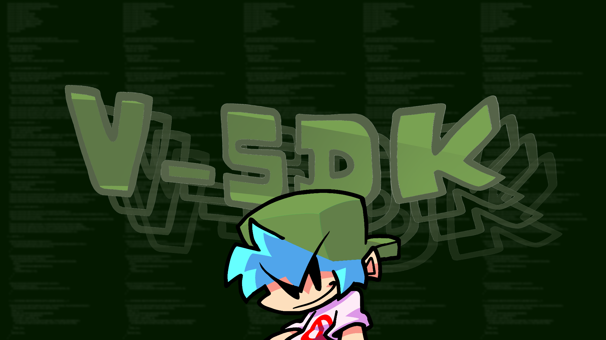

#  V-SDK: Universal Modding Framework

  

**Stability. Interoperability. Power.**

V-SDK is a high-performance, standardized API designed specifically for **Friday Night Funkin' V-Slice** on Mobile (Android) and PC. It acts as a bridge between mods, preventing common engine crashes and providing a unified toolset for developers.

---

##  Why V-SDK?
Modding the V-Slice engine, especially on Android, often leads to "Invalid Access", "Null Objects", and parsing errors. V-SDK solves this by implementing a **Safe-Access Layer**.

* ** Anti-Crash Engine:** Uses reflection-based calls to ensure scripts don't break on Android.
* ** V-Link Protocol:** Allows different mods to talk to each other (e.g., PerfectModes communicating with TimeBar).
* ** Universal Search:** Find any object (Strumlines, Bars, Sprites) inside the PlayState without hardcoding paths.
* ** Lightweight:** Zero performance impact.

---

## Key Features
V-SDK provides a suite of ready-to-use functions to simplify modding:

| Feature | Description |
| :--- | :--- |
| **Data Registry** | Global storage for variables that persist between different mods. |
| **UI Controller** | Easy manipulation of HealthBars, TimeBars, and HUD elements. |
| **Audio Sync** | Advanced control over Pitch, Vocals, and BPM. |
| **Visual Effects** | Safe Camera Shakes, Zooms, and Object Tweens. |

---

## The V-Link Ecosystem (Integrations)
V-SDK is designed to be a "Mod Linker". Current supported integrations:
* **PerfectModes x TimeBar:** Dynamic UI color shifting based on difficulty modes.
* **HBPlus Compatibility:** Safe-layer for icon-colored health bars.

---

## Author & Credits
* **Lead Architect:** [Omenun](https://github.com/TU_USUARIO_AQUI)
* **Contributors:** Special thanks to **JugieNoob** for the inspiration and the amazing tools (TimeBar/HBPlus) that helped test this framework.

---

## License
This project is licensed under the **GNU General Public License v3.0**. 
*You are free to use, modify, and distribute this SDK, provided that you credit the original author and share your modifications under the same license.*

---
*Developed with Love for the FNF Modding Communty*

